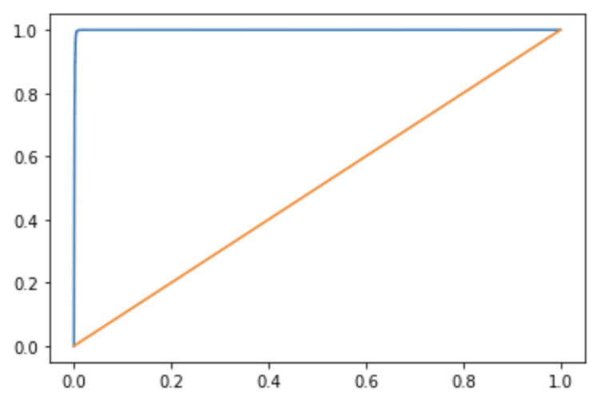

# **Credit Risk Prediction - id/x partners Final Project Internship**
This is a project on virtual internship program from Rakamin Academy. This program were held 1 month and this project is the final exam.

## **The Goal**
This project's aim is to create machine learning model that has capability to predict what type of customer should receive loan. 

## **The Process**
### **Data Extraction and Preprocessing**
Whole dataset are already provided and i directly jumped into data preprocessing. This dataset contain 70+ up features related to customer financial characteristic. There are some problems in this dataset, for example there are so many missing value, outliers, problem with data format, etc. I did some preprocessing to solve this problem (detail can be seen on ipynb file in this repository). Also in this preprocessing step, i used some visualization graph to grab insight from data and considering some feature's graph to handle problem on other features.

### **Modeling and Evaluation**
After data are ready, i built model with classification approach. I used 4 model, logistic regression, decision tree classifier, random forest classifier, and k nearest neighbor. In this step, i evaluated model with cross validation method with up to 99%+ ROC score. After evaluation step, logistic regression show the best result.
Here AUC ROC curve for logistic regression :

